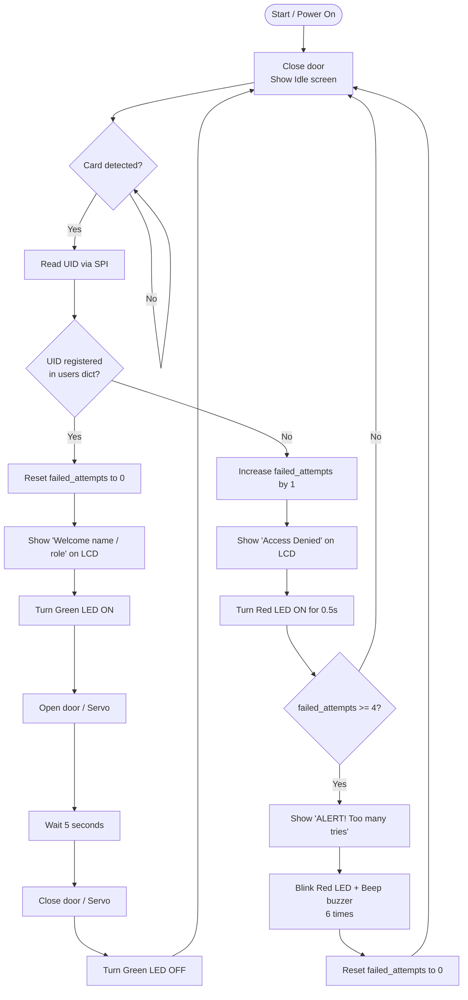

# 🔐 Smart Access System

A smart access control system for a secured room, using RFID cards instead of a traditional key.
Built on a **Raspberry Pi Pico**, programmed in **MicroPython**, and simulated on **Wokwi**.

---

## 📌 Project Overview

The system reads an RFID card, identifies the cardholder (if registered), displays their name and role on an LCD screen, and unlocks the door (via a servo motor) for a limited time before automatically locking it again.
If the card is unknown, access is denied and the attempt is logged as a "failed attempt." After repeated failed attempts, a security alarm (sound + light) is triggered.

---

## 🧩 Components Used

| Component | Purpose |
|---|---|
| Raspberry Pi Pico | Main microcontroller |
| RFID-RC522 | Reads RFID cards and retrieves the UID |
| LCD 16x2 (I2C) | Displays status messages to the user |
| Servo Motor | Simulates the door lock (open/close) |
| Green LED | Indicates successful access |
| Red LED | Indicates denied access / alarm |
| Buzzer (Passive, PWM) | Audible alert during the alarm |

---

## 👥 Registered Users

| Card Color | Name | Role |
|---|---|---|
| 🟡 Yellow Card | Ahmed | Employee |
| 🔵 Blue Card | Sara | Manager |
| 🟢 Green Card | Omar | Employee |
| 🔴 Red Card | Menna | Admin |

---

## ⚙️ System Logic

1. **Idle State** — The LCD displays "Please scan your card" while the system waits.
2. **Card Scan** — The RC522 reader detects the card and reads its UID.
3. **Access Granted** — If the UID is registered: the user's name and role are displayed, the green LED turns on, the door opens for 5 seconds and then closes automatically, and the failed-attempts counter resets.
4. **Access Denied** — If the UID is not registered: "Access Denied" is displayed, the red LED turns on, and the failed-attempts counter increases.
5. **Security Alarm** — After 4 consecutive failed attempts: an alarm sequence runs (blinking red LED + repeated buzzer tone, 6 times), then the counter resets and the system returns to Idle.

---

## 🧠 System Logic Flow



### Logic Summary

| Step | Condition | Action |
|---|---|---|
| Idle | No card present | LCD shows "Please scan your card" |
| Card scanned | UID found in `users` | Grant access → show name/role → open door 5s → close door → reset counter |
| Card scanned | UID **not** found | Deny access → show "Access Denied" → red LED → increase `failed_attempts` |
| Failed attempts | `failed_attempts >= 4` | Trigger alarm → blink + beep ×6 → reset counter → back to idle |
| Failed attempts | `failed_attempts < 4` | Return to idle silently (no alarm yet) |

---

## 🔌 Wiring Diagram

### RFID-RC522 (SPI)
| RC522 | Pico |
|---|---|
| VCC | 3.3V |
| GND | GND |
| RST | GP20 |
| MISO | GP16 |
| MOSI | GP19 |
| SCK | GP18 |
| SDA/SS/CS | GP17 |

### LCD (I2C)
| LCD | Pico |
|---|---|
| VCC | 5V |
| GND | GND |
| SDA | GP4 |
| SCL | GP5 |

### Other Components
| Component | Pico Pin |
|---|---|
| Servo Signal | GP15 |
| Green LED | GP14 |
| Red LED | GP13 |
| Buzzer | GP12 |

---

## 📁 Project Files

```
├── main.py             # Main system logic
├── mfrc522.py           # MFRC522 RFID driver (SPI)
├── lcd_api.py            # Generic HD44780 LCD driver API
├── pico_i2c_lcd.py         # I2C hardware layer for the LCD on the Pico
└── README.md
```

---

## 🧪 How to Run (on Wokwi)

1. Create a new MicroPython project for Raspberry Pi Pico on [wokwi.com](https://wokwi.com).
2. Add the components: RFID-RC522, LCD1602 (I2C), Servo Motor, 2× LED, Buzzer.
3. Add the four project files (`main.py`, `mfrc522.py`, `lcd_api.py`, `pico_i2c_lcd.py`) as separate tabs.
4. Wire the pins according to the table above.
5. Run the simulation (▶️ Play) and test the cards from the RC522's control panel.

---

## 🛠️ Built With

- Raspberry Pi Pico
- MicroPython
- Wokwi Simulator
